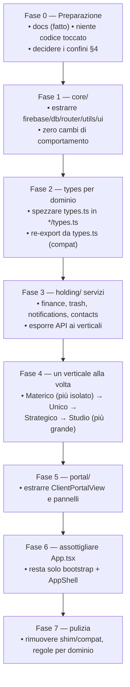

# Architettura target & piano di migrazione — 5 gestionali

> **Scopo.** Bozza della struttura a cartelle/moduli per ristrutturare la
> piattaforma (**Aulico**) come **5 gestionali** (Holding/Aulico + Onirico ·
> Materico · Unico · Strategico), e piano per migrarci dall'attuale `App.tsx`
> monolitico (~3100 righe) **senza rompere nulla**.
>
> Lo strato `holding/` proposto sotto **è il core "Aulico"** (DB centrale +
> servizi comuni neutri, operati da Strategico). Il verticale `studio/` è
> **"Onirico"** in UI (chiave codice invariata). Integrazione del feedback:
> `VISIONE-AULICO.md`. **Le società sono QUATTRO** (Onirico, Materico, Unico,
> Strategico) + holding Aulico — **NON esiste una 5ª società**. L'albero §2 resta
> comunque pronto ad accogliere nuovi verticali, ma non è pianificato nulla.
>
> ⚠️ **Questo è solo un piano.** Nessun file sorgente è stato modificato.
> Procederemo all'implementazione solo quando lo deciderai. Riferimenti: vedi
> `FLUSSI-DI-LAVORO.md` (§10) per i principi e `MANUALE-FUNZIONALE.md` per i nodi.

---

## 1. Stato attuale (da cui partiamo)

```
src/
├─ App.tsx            ← ~3100 righe: stato globale, sub Firebase, TUTTI gli
│                       handler, router a hash, modali, notifiche. "Tutto qui."
├─ firebase.ts        ← init + helper DB/auth
├─ finance.ts         ← motore finanziario (puro) + colori/label società
├─ types.ts           ← TUTTE le interfacce insieme
├─ utils.ts           ← safeUrl, composeAddress, ecc.
├─ i18n.tsx           ← layer IT/EN
├─ showcaseData.ts    ← config vetrina + demo
└─ components/        ← ~50 viste/widget in un'unica cartella piatta
```

**Problema principale:** `App.tsx` è di fatto **lo shell Holding + i 4 verticali
fusi insieme**. `components/` è piatta: non si vede a quale gestionale appartiene
un file. `types.ts` mescola i domini.

**Cosa NON va toccato come comportamento** durante la migrazione: i nodi DB e le
regole restano gli stessi (la migrazione è di *codice*, non di *dati*); l'app
deve continuare a buildare con `npm run build`.

---

## 2. Struttura target (feature-folder per dominio)

Ogni gestionale diventa una **cartella di dominio** che possiede viste, stato,
handler, tipi e logica propri. Lo strato condiviso (Holding + core tecnico) sta a
parte. Proposta:

```
src/
├─ core/                      # 🔌 infrastruttura tecnica (no business)
│   ├─ firebase.ts            # init + helper generici (watchNode, writeNode…)
│   ├─ db.ts                  # KEY2PATH, syncState, clean — astrazione persistenza
│   ├─ router.ts             # parsing hash → route (oggi inline in App)
│   ├─ utils.ts               # safeUrl, composeAddress, normalizzazioni legacy
│   ├─ i18n.tsx
│   └─ ui/                    # design system condiviso (vedi LINEE-GUIDA-GRAFICHE)
│       ├─ Modal.tsx  Card.tsx  Pillbar.tsx  Button.tsx  Badge.tsx
│       ├─ ConfirmDeleteModal.tsx  AppleSwitch.tsx  SmartText.tsx …
│       └─ tokens.ts          # colori/raggi se servono in TS
│
├─ holding/                   # 🏛️ il 5° gestionale (orchestratore + trasversali)
│   ├─ AppShell.tsx           # layout, sidebar/navbar, instradamento per ruolo
│   ├─ auth/                  # login, ruoli, accessi (AuthFlow, AccessRequests)
│   ├─ finance/               # FinanzeView, QuotesView/QuoteEditor, StatsView,
│   │                          #   finance.ts (motore), handler finanza, consolidato
│   ├─ contacts/              # rubrica clients + crmSuppliers + directory (CrmView)
│   ├─ calendar/              # appointments + teamLeave (CalendarView)
│   ├─ notifications/         # notifications + centro notifiche + reminder soft
│   ├─ trash/                 # trash, moveToTrash, askDelete (TrashView)
│   ├─ team/                  # TeamView (gestione iscritti, produttività)
│   └─ dashboard/             # DashboardView (overview cross-società)
│
├─ studio/                    # 🏛️ gestionale Studio (architettura/pratiche)
│   ├─ projects/              # ProjectsView, fascicolo, fasi/task, ThreeDProgress
│   ├─ documents/             # DocumentsView, projectMessages
│   ├─ furnishings/           # FurnishingsBoard + moodboard3d/
│   ├─ cantiere/              # CantiereBoard + cantiere/* + impresa
│   ├─ economics/             # contabilità di commessa, projectEconomics
│   ├─ types.ts               # Project, Task, Cantiere, Furnishing, …
│   └─ handlers.ts            # save/delete progetti, task, cantiere, …
│
├─ materico/                  # 🧱 gestionale Materico
│   ├─ MatericoView.tsx       # hub operatore (inbox, inoltro, offerte, margine)
│   ├─ MatericoPortal.tsx     # lato partner (offerte)
│   ├─ types.ts               # MatericoRequest, MatericoOffer, MatericoItem
│   └─ handlers.ts
│
├─ unico/                     # 🏘️ gestionale Unico (immobiliare + investitori)
│   ├─ UnicoStudioView.tsx    # operazioni, SPV/cap table, rendiconto, aggiornamenti
│   ├─ showcase/              # UnicoShowcaseEditor, snapshot unicoShowcase
│   ├─ investors/             # MyInvestmentsPanel, unicoInvestorPositions
│   ├─ types.ts               # UnicoDeal, UnicoInvestor, UnicoShowcase*, …
│   └─ handlers.ts            # saveUnicoDeals (+ write-through snapshot)
│
├─ strategico/                # 📣 gestionale Strategico (marketing project-centric)
│   ├─ StrategicoView.tsx     # shell 3 livelli (Dashboard→Progetti→workspace)
│   ├─ acquisition/           # lead, flows, seo, ads
│   ├─ production/            # assets, deliverables, proofs
│   ├─ relation/              # events, campaigns, social, surveys, inbox
│   ├─ economy/               # contracts, time entries (bridge → holding/finance)
│   ├─ data/                  # metrics, consents
│   ├─ types.ts               # MktProject + tutti i Mkt*
│   └─ handlers.ts
│
├─ portal/                    # 🚪 portali esterni (cliente/partner/investitore)
│   ├─ ClientPortalView.tsx   # orchestratore portale cliente
│   ├─ ServicesShowcase.tsx   # vetrina servizi
│   ├─ CinematicShowcase.tsx  # landing cinematica
│   └─ panels/                # ClientRequestPanel, MarketingPortalPanel, …
│
└─ main.tsx                   # entrypoint
```

> Nota: `portal/` è una **shell + registro di moduli** (dashboard unica adattiva,
> vedi `DASHBOARD-E-MODULARITA.md`): ogni modulo vive nel suo dominio
> (`studio/portal/`, `unico/investors/`, `materico/portal/`, `strategico/portal/`)
> ed espone un `DashboardModule` (lazy + error boundary). La shell monta solo i
> moduli attivi per l'utente (relazioni/indici esistenti). Stesso pattern
> compositore, dove utile, per i dashboard interni (`holding/dashboard/`,
> `holding/finance/`, `holding/contacts/`).

---

## 3. Come si scompone `App.tsx`

`App.tsx` oggi fa 6 cose. Vanno separate così:

| Responsabilità attuale in App.tsx | Va in |
|---|---|
| Stato globale + sottoscrizioni Firebase | un **context per dominio** (o store) — es. `studio/useStudioData`, `materico/useMatericoData`… sopra un `core/db` |
| Router a hash (`renderView`/`switch(route)`) | `core/router` + `holding/AppShell` |
| Handler save/delete per dominio | `*/handlers.ts` del rispettivo gestionale |
| Modali globali (confirm, notifiche) | `holding/` (trash, notifications) + `core/ui` |
| Instradamento per ruolo (studio vs portale) | `holding/AppShell` |
| `KEY2PATH`, `syncState`, `clean` | `core/db.ts` |

**Pattern consigliato:** un **DataProvider per gestionale** che incapsula le sub
Firebase e i suoi handler, esposti via hook (`useStudio()`, `useMaterico()`…). Lo
shell Holding monta solo i provider necessari al ruolo dell'utente (il team monta
tutti; il portale monta il sottoinsieme).

---

## 4. Confini delicati (decidere PRIMA di spostare codice)

Sono i punti dove "Holding" e "verticali" si toccano. Vanno definiti come
**interfacce esplicite**, non come import incrociati a caso.

1. **Finanza.** Ogni verticale produce eventi economici ma *non possiede* la
   finanza. → Holding espone un servizio `finance.record({sector, projectId,
   type, amount…})`; i verticali lo chiamano. Niente scrittura diretta dei nodi
   finanza dai verticali.
2. **Anagrafiche (rubrica/fornitori).** Possedute dalla Holding; i verticali le
   *leggono* (selettori) e al massimo propongono nuovi record via un servizio.
3. **Cestino & doppia conferma.** Servizio Holding `trash.remove(section,
   payload)` usato da tutti; nessun verticale reimplementa l'eliminazione.
4. **Notifiche.** Servizio Holding `notify(uid|studio, …)`; i verticali lo usano.
5. **Snapshot read-only verso i portali.** Pattern di "pubblicazione": il
   verticale scrive uno snapshot divulgabile (oggi `projectEconomics`,
   `unicoShowcase`, `unicoInvestorPositions`) — formalizzarlo come funzione del
   dominio.
6. **Flussi inter-società** (Unico→Studio/Materico, Strategico→tutte): modellarli
   come **commesse interne** con un riferimento esplicito, non come accesso
   diretto ai dati dell'altro dominio.

---

## 5. Piano di migrazione incrementale (a rischio basso)

Migrazione "a buccia di cipolla": si sposta un dominio per volta, l'app resta
sempre funzionante e buildabile. **Una fase = una PR verificabile.**



**Ordine dei verticali** (dal più isolato al più intrecciato): **Materico → Unico
→ Strategico → Studio**. Studio per ultimo perché è il più grande e più collegato
a finanza/cantiere/portale.

**Regole di sicurezza della migrazione:**
- Ogni fase **compila** (`npm run build`) e si fa **merge su `main` separatamente**
  (deploy GitHub Pages = verifica reale).
- Mantieni **shim di compatibilità** (re-export dai vecchi percorsi) finché tutti
  i riferimenti non sono aggiornati → niente "big bang".
- **Nessun cambio ai nodi DB / regole** durante la ristrutturazione del codice: i
  dati restano dove sono. Le regole si riorganizzano (cosmeticamente) solo in
  Fase 7, senza cambiarne la semantica.
- Spostamenti file con `git mv` per preservare lo storico.

---

## 6. Punti aperti — DECISI ✅

Tutti chiusi (vedi `REGISTRO-DECISIONI.md`):
1. **Stato globale** = **Context API per dominio** (hook `useStudio`/`useUnico`…),
   nessuna dipendenza nuova, coerente con l'isolamento dei moduli.
2. **Pannelli portale** = **dentro ciascun dominio**; `portal/` è solo shell +
   registro di moduli (`DASHBOARD-E-MODULARITA.md`).
3. **Confine Finanza** = servizio core **`finance.record()`** (i verticali non
   scrivono più i nodi finanza direttamente).
4. **Granularità** = **sotto-fasi piccole, più PR** verificabili.
5. **Ordine primo lotto** = Rebrand → RBAC → ROE Unico → KPI funnel.

---

## 7. Cosa NON cambia con questa ristrutturazione

Per evitare equivoci: è una **ri-organizzazione del codice**, non un redesign.

- ✅ Nessun cambio a funzionalità, UI o flussi utente.
- ✅ Nessun cambio ai dati su Firebase né alle regole (semantica invariata).
- ✅ Stesso stack, stesso deploy.
- ✅ Stile invariato (anzi: `core/ui` lo rende più coerente).

Il guadagno è: **confini chiari tra i 5 gestionali**, `App.tsx` non più
monolitico, ogni società sviluppabile in isolamento, più facile aggiungere moduli.

---

## 8. Dove atterrano i nuovi moduli Aulico

Mappa delle estensioni richieste (`VISIONE-AULICO.md`) sull'albero §2:

| Estensione Aulico | Dominio target |
|---|---|
| RBAC granulare per-società (`access`) | `holding/auth/` + regole |
| Lead Point of Entry (smistamento) | `strategico/acquisition/` + `holding/contacts/` |
| Funnel commessa + voci predefinite + Cartella Cliente | `studio/projects/` (+ listino in `holding/`) |
| Firma OTP (Onirico/Materico) | servizio `core/` o `holding/` (provider esterno) |
| Cascata ROE Unico (3%/15%/€10k/4%) | `unico/` + motore `holding/finance/` (finance.ts) |
| Penali automatiche + point system | `materico/` + cron `functions/` |
| Render AI da foto+questionario | `studio/` + `functions/` (AI immagini) |
| Alert 60gg + blocco cantiere | `studio/cantiere/` + cron `functions/` |
| Report settimanale automatico | `studio/cantiere/` + cron `functions/` |
| KPI funnel di gruppo | `holding/finance/` (StatsView) |
| WhatsApp API | `functions/` + provider |
| ~~Gestione Immobili/affitti~~ | 🚫 scartata — NON esiste 5ª società (solo 4) |

Le funzioni che richiedono **backend/provider esterni** (OTP, WhatsApp, AI
immagini, cron) NON bloccano la ristrutturazione del codice: vanno nella "fase
backend" e si innestano sui domini sopra.

---

*Piano di riferimento. Da rivedere insieme sui "punti aperti" (§6) e sui punti di
`VISIONE-AULICO.md` §13 prima di scrivere la prima riga di codice.*
