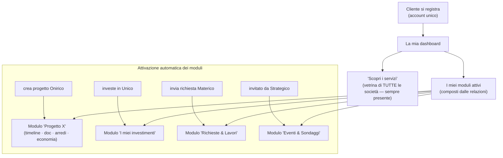
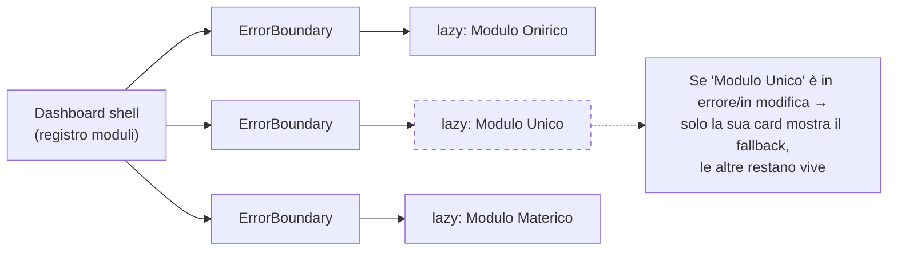

# Dashboard, portali & modularità

> **Scopo.** Definire come sono fatti i **dashboard** (interni CRM/Finanza e
> portale cliente/partner) e come si garantisce la **separazione dei moduli**:
> poter modificare/aggiungere una cosa **senza bloccare il resto della
> piattaforma**. Recepisce le decisioni prese con il committente.
>
> **Decisioni recepite:**
> - Portale cliente/partner = **dashboard unica adattiva** (moduli che si
>   agganciano da soli).
> - Dashboard "insieme di tutto" di CRM e Finanza = **estendere gli esistenti**
>   (aggregato + segmentazione per società).
>
> ⚠️ **Nessuna modifica alla piattaforma.** Documento di pianificazione.

---

## 1. Principio guida: la dashboard è un *compositore di moduli*

Una dashboard **non** è una pagina monolitica: è una **shell sottile** che monta
una **lista di moduli indipendenti** ("card"). Ogni modulo è autonomo: ha i suoi
dati, il suo codice, il suo ciclo di vita.

```
Dashboard (shell)  =  registro di moduli  →  [ Modulo A ] [ Modulo B ] [ Modulo C ]
                                                  ↑ ognuno: lazy + isolato + error boundary
```

Questo è ciò che rende vero il requisito *"se cambio una cosa non blocco tutto"*:
se un modulo è in errore o lo stai aggiornando, **mostra un fallback nella sua
card; gli altri continuano a funzionare**. Niente schermata bianca globale (oggi,
col monolite `App.tsx`, un errore può buttare giù l'intera app).

---

## 2. Portale cliente/partner — dashboard unica adattiva

**Un solo account, una sola home.** I moduli **compaiono da soli** in base alle
relazioni che l'utente ha davvero (non in base a "pagine" diverse). Quando il
cliente **crea un progetto**, il modulo relativo **si aggancia** alla sua
dashboard, perché nasce la relazione.



**Mappa attivazione moduli (si appoggia a relazioni GIÀ esistenti):**

| Modulo dashboard | Società | Compare quando… | Fonte dati / trigger |
|---|---|---|---|
| Progetto «Nome» | Onirico | il cliente ha un progetto collegato | `clientUid` / `projectIds` |
| I miei investimenti | Unico | il cliente è investitore | `unicoInvestorPositions/<uid>` |
| Richieste & Lavori | Materico | il cliente ha richieste | indice `clientMaterico/<uid>` |
| Eventi & Sondaggi | Strategico | il cliente è invitato | indice `mktInvitesIndex/<uid>` |
| Le mie richieste / "La tua idea" | Aulico | sempre (CTA) | `clientRequests/<uid>` |
| Scopri i servizi (vetrina) | tutte | sempre | `ServicesShowcase` |

**Partner** = stessa logica, moduli diversi:

| Modulo | Compare quando… | Fonte |
|---|---|---|
| Offerte Materico | il partner riceve richieste inoltrate | indice `partnerMaterico/<uid>` |
| Cantieri assegnati | il partner è assegnato a un cantiere | indice `partnerCantieri/<uid>` |
| La mia impresa | sempre (profilo riusabile) | `impresaDocs`/`impresaRecords/<uid>` |

**Vantaggio chiave:** un utente che è *insieme* committente Onirico **e**
investitore Unico vede tutto in **una** dashboard — niente doppio login, niente
pagine duplicate, nessun "portale per società".

---

## 3. Dashboard interni CRM e Finanza — aggregato + per-società

Si **estendono gli strumenti esistenti**, non si creano pagine parallele. Pattern
unico: **vista d'insieme (Consolidato) + selettore/segmentazione per società**.

- **Finanza** (`FinanzeView` + `StatsView`): già ha il selettore Studio ·
  Strategico · Materico · Unico · **Consolidato**. Si potenzia con il **funnel di
  gruppo**: Preventivato → Venduto → Erogato → Fatturato → Incassato → Liquidità,
  per-società + totale. ⚠️ I **giri interni** (commesse interne, es. Unico→Onirico
  15%) sono **elisi nel Consolidato** (vedi `SCHEMA-COMMESSE-INTERNE.md` §3).
- **CRM** (`CrmView`): riceve lo **stesso selettore società** (lead, clienti,
  preventivi aggregati + filtro per società), così la direzione vede l'insieme e
  poi scende nella singola società.

> Questi sono **moduli del core Aulico** (finanza, contatti): aggregano leggendo i
> dati taggati `sector`, coerentemente con la convergenza a finanza.

---

## 4. Contratto di un "modulo dashboard"

Per essere componibile e isolato, ogni modulo espone un'interfaccia minima e
**non conosce gli altri moduli**.

```ts
interface DashboardModule {
  id: string;                       // 'onirico-project' | 'unico-investments' | …
  company: Company | 'aulico';      // società di appartenenza (per colore/raggruppamento)
  // il modulo decide DA SOLO se è attivo per questo utente (legge le sue relazioni)
  isActiveFor(ctx: UserContext): boolean;
  // caricamento pigro: il codice arriva solo se il modulo è attivo
  load: () => Promise<{ default: React.ComponentType<ModuleProps> }>; // React.lazy
  order?: number;                   // posizione nella dashboard
}
```

La dashboard (shell) fa solo: per ogni modulo registrato → `isActiveFor` → se sì,
**lazy-load** dentro un **Error Boundary** → render della card. **Aggiungere un
modulo = registrare una voce**; modificarlo = toccare solo la sua cartella.

---

## 5. Le 4 garanzie di isolamento ("non bloccare tutto")

1. **Feature-folder per dominio** (`ARCHITETTURA-TARGET §2`): codice di un modulo
   tutto in una cartella; modifichi Onirico senza aprire Materico.
2. **Lazy-load per modulo** (`React.lazy`): chunk separati; un modulo si carica
   solo se attivo. (Pattern già usato per il Moodboard 3D.)
3. **Error Boundary per card**: un crash/refactor di un modulo degrada **solo
   quella card** (fallback), non l'app. (Pattern già usato:
   `MoodboardErrorBoundary`.)
4. **Nessuna lettura incrociata**: i moduli comunicano solo via i 5 pattern
   (`GESTIONALI-SPECIFICHE §8`): snapshot read-only, `finance.record()`, commessa
   interna, indici inversi, servizi core. Cambiare lo schema interno di un modulo
   **non rompe** gli altri.



---

## 6. Impatto sull'architettura target

Coerente con `ARCHITETTURA-TARGET.md`:
- Il **portale** (`portal/`) diventa una **shell + registro di moduli**; ogni
  modulo vive nel suo dominio (`studio/portal/`, `unico/investors/`,
  `materico/portal/`, `strategico/portal/`) ed espone un `DashboardModule`.
- I **dashboard interni** restano nel core (`holding/finance/`, `holding/contacts/`,
  `holding/dashboard/`) ma adottano lo stesso pattern compositore dove utile.
- Nessun nodo DB nuovo: l'attivazione dei moduli usa relazioni/indici esistenti.

---

## 7. Decisioni prese sull'esperienza dashboard ✅

1. **Raggruppamento = sezioni per società.** I moduli sono raggruppati sotto un
   sottotitolo per società (Onirico, Materico, Unico, Strategico) con il colore
   settore. Resta **una sola dashboard**.
2. **Ordine = per attività recente** (conciliato con le sezioni):
   - **dentro** ogni sezione società → moduli ordinati per aggiornamento più
     recente (es. progetto con nuovo SAL/documento in cima);
   - **le sezioni** stesse → ordinate per attività più recente complessiva (la
     società che si è mossa per ultima sale in alto).
3. **Stato vuoto = wizard guidato iniziale.** Un cliente appena registrato (nessun
   modulo attivo) entra in un **percorso a step** che chiede di che servizio ha
   bisogno e lo indirizza (crea richiesta/progetto → genera la relazione → il
   modulo si aggancia). La vetrina "Scopri i servizi" resta sempre disponibile.

> Nota implementativa: il **wizard** è l'unico elemento "nuovo da costruire" tra
> queste scelte (ordinamento e sezioni sono presentazione). Tenerlo **modulo a sé**
> (lazy + isolato) come gli altri, così non pesa sul resto.

---

*Documento di riferimento per dashboard e modularità. Tenere in sync con
`ARCHITETTURA-TARGET.md` (§2/§5) e `GESTIONALI-SPECIFICHE.md` (§8).*
