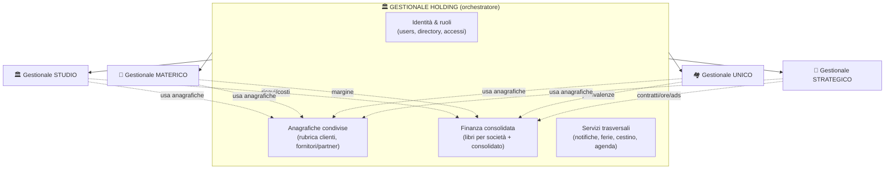
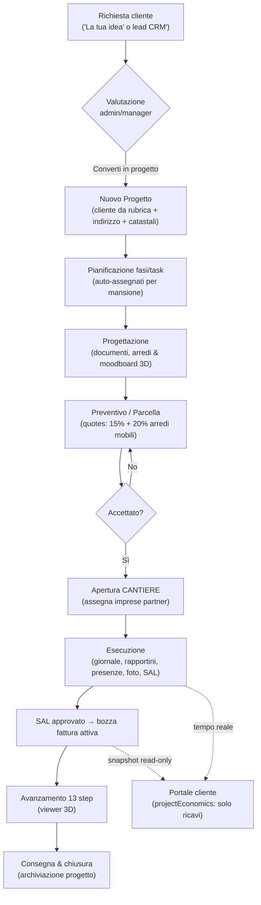
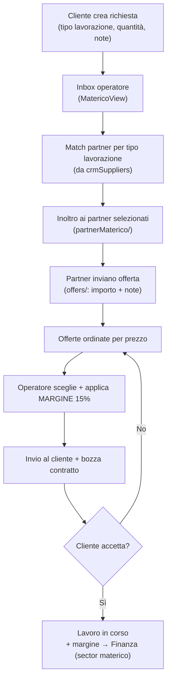
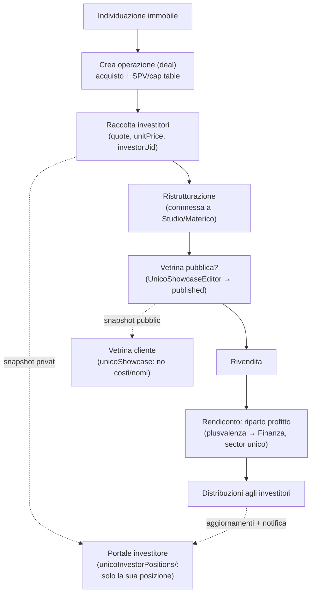
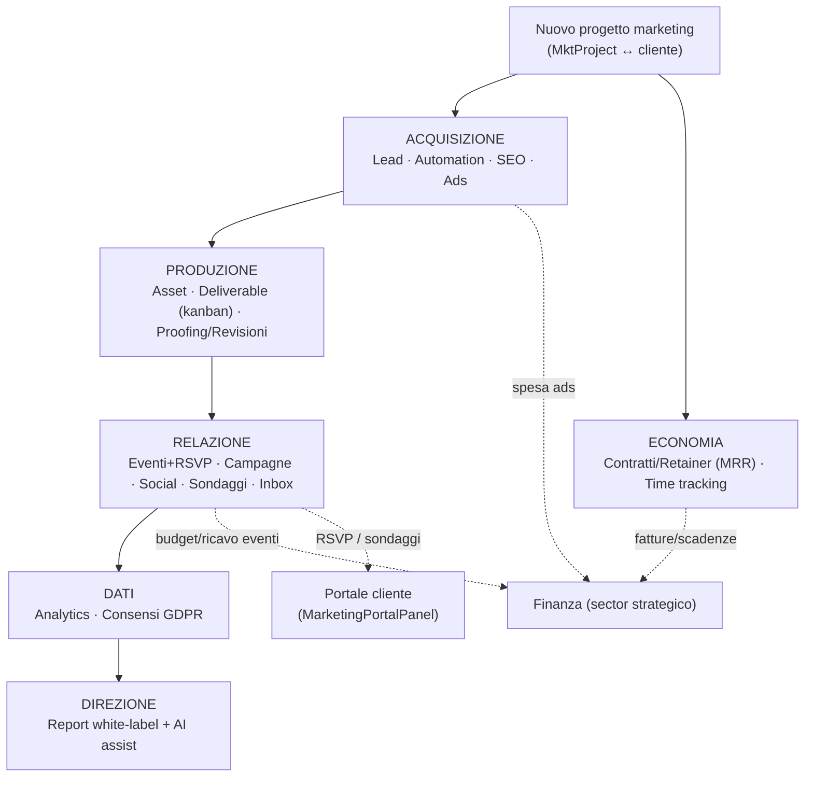
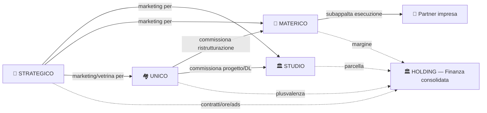
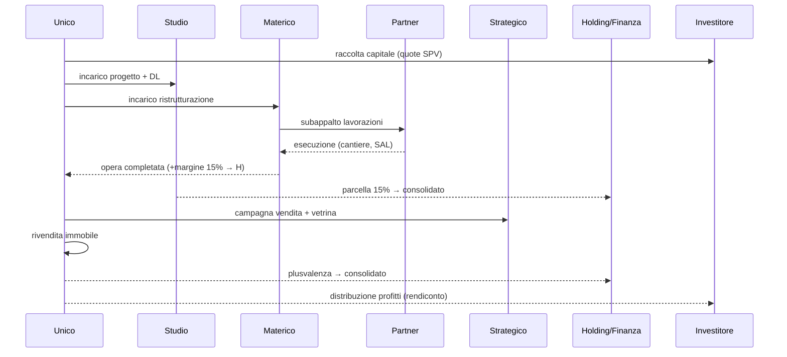
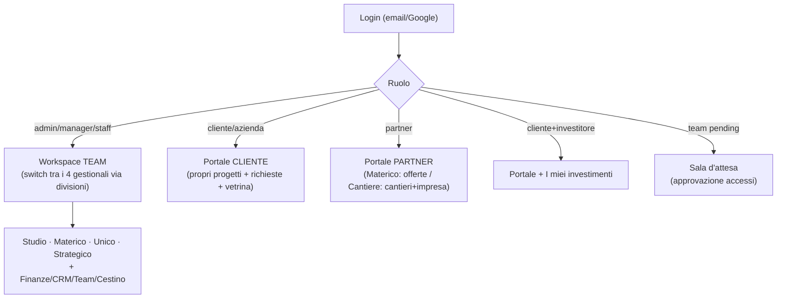
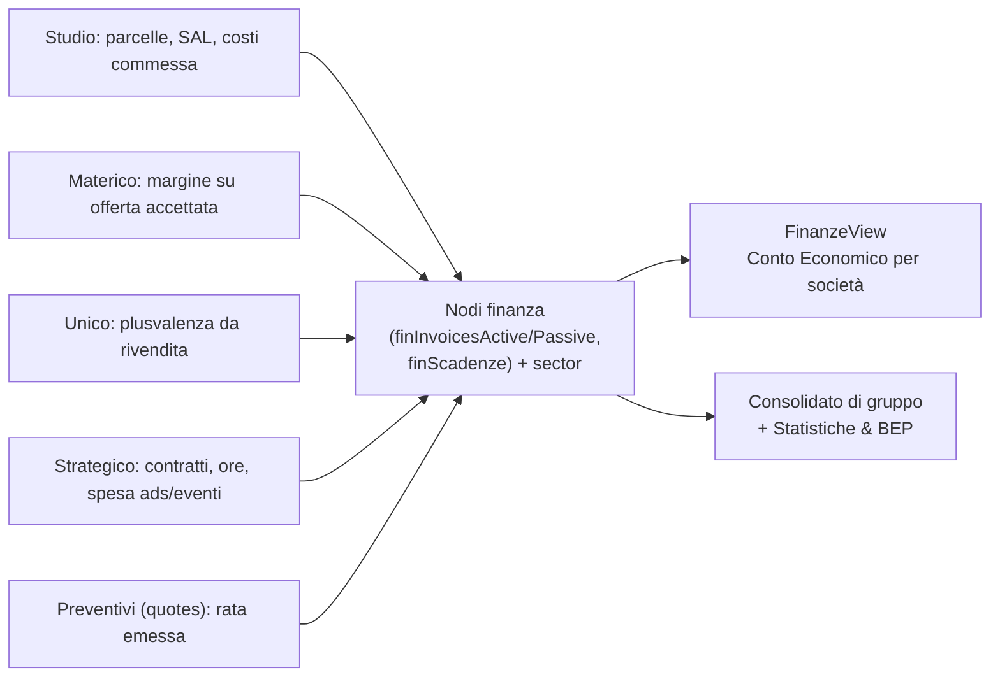
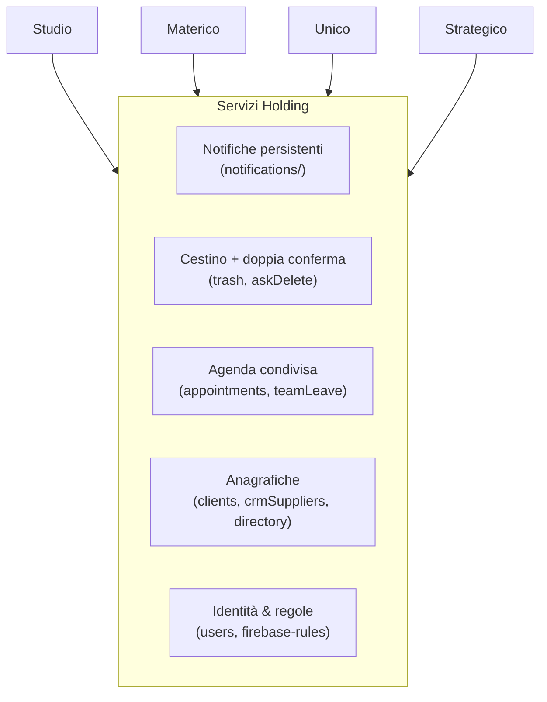

# Flussi di lavoro — Aulico come 5 gestionali

> **Scopo.** Vedere la piattaforma come **5 gestionali**: 4 verticali (Onirico/
> Studio, Materico, Unico, Strategico), ciascuno con il proprio flusso di lavoro,
> orchestrati da un 5° **gestionale Holding = Aulico** (DB centrale + servizi
> comuni). Serve come base per ristrutturare l'app "da zero" con confini netti.
>
> Rebrand: la Holding è **Aulico**; il verticale `studio` in UI è **"Onirico"**.
> Mappa nomi e integrazione del feedback in **`VISIONE-AULICO.md`**.
>
> I diagrammi sono in **Mermaid** (si renderizzano su GitHub e nei principali
> editor). Sono fondati sui flussi reali oggi nel codice — vedi
> `MANUALE-FUNZIONALE.md` per i dettagli e `LINEE-GUIDA-GRAFICHE.md` per lo stile.

---

## 0. Il modello a 5 gestionali

L'idea: **4 gestionali verticali** indipendenti per le 4 società + **1 gestionale
Holding** che fornisce lo strato comune (identità, anagrafiche, finanza
consolidata, notifiche, cestino) e fa da "telecomando" che apre il gestionale
giusto in base a chi entra e a quale società sta guardando.

**Principio guida della ristrutturazione:** ogni gestionale verticale possiede i
**propri dati operativi** e i **propri flussi**; tutto ciò che è *condiviso o
trasversale* sale nella Holding. Le società comunicano tra loro **solo** tramite
contratti/commesse esplicite (vedi §6), mai mescolando i dati.

---

## 1. Cosa possiede ciascun gestionale

| Gestionale | Possiede (dati propri) | Espone alla Holding |
|---|---|---|
| **Holding** | `users`, `directory`, accessi, `clients` (rubrica), `crmSuppliers`, nodi **finanza** (`finInvoicesActive/Passive`, `finScadenze`, `finBank`, `quotes`), `notifications`, `teamLeave`, `appointments`, `trash` | l'orchestrazione + il consolidato |
| **Studio** | `projects`, `tasks`, `templates`, `documents`, `projectMessages`, `projectFurnishings`, `projectMoodboard3d`, `cantieri`+`cantiere*`, `impresa*`, `projectEconomics` | parcelle/SAL → finanza |
| **Materico** | `matericoRequests` (+ indici `clientMaterico`/`partnerMaterico`) | margine 15% → finanza |
| **Unico** | `unicoDeals`, `unicoShowcase`, `unicoInvestorPositions` | plusvalenza → finanza |
| **Strategico** | `mktProjects` + tutti i nodi `mkt*` | contratti/ore/ads → finanza |

---

## 2. Flusso interno — Gestionale STUDIO

Il ciclo di vita di una **pratica** (commessa architettonica): dalla richiesta
alla consegna, con cantiere e contabilità.

**Attori:** cliente (richiesta, portale) · staff (esecuzione) · admin/manager
(valutazione, finanza) · partner impresa (cantiere).

**Punti di passaggio alla Holding:** ogni costo/ricavo/scadenza registrato porta
`projectId` + `sector:'studio'` → confluisce nel **consolidato** finanziario.

> **(target Aulico) Funnel di conversione Onirico:** Inserimento minimo (voci di
> costo predefinite) → Generazione automatica preventivo → **Firma OTP** →
> **Creazione automatica "Cartella Cliente" + task**. Fasi: Pianificazione ·
> Progettazione · Esecuzione · **Abilitazione** (agibilità → gamification cliente).
> Naming commessa `Cliente + Località`. Vedi `VISIONE-AULICO.md` §5.

---

## 3. Flusso interno — Gestionale MATERICO

Materico è un **intermediario**: prende richieste del cliente, le fa quotare ai
partner, applica un margine e rivende.

**Indici inversi** che reggono il flusso (RTDB non filtra): `clientMaterico/<uid>`
(richieste del cliente) e `partnerMaterico/<uid>` (richieste inoltrate al partner).

> **(target Aulico) Estensioni Materico:** dopo l'accettazione il contratto si
> firma con **OTP**; le scadenze contrattuali sono monitorate e i **ritardi
> attivano penali automatiche**; le attività svolte assegnano **punti** (point
> system incentivi). Vedi `VISIONE-AULICO.md` §7.

---

## 4. Flusso interno — Gestionale UNICO

Unico è un **veicolo d'investimento immobiliare**: compra, ristruttura (spesso
*via Materico/Studio*), rivende, ripartisce il profitto agli investitori.

**Doppio snapshot derivato** (write-through da `saveUnicoDeals`): pubblico
(`unicoShowcase`, solo campi divulgabili) e privato per-investitore
(`unicoInvestorPositions`, solo la propria posizione).

> **(target Aulico) Cascata ROE analitica** — il margine semplice diventa una
> cascata di costi: Terreno + Agenzia **3%** + Notaio + **Progettazione Onirico
> 15%** + Opere + **Promozione Strategico €10k** + **Rivendita 4%** → ROE + tempi
> di ritorno. Le voci Onirico/Strategico sono **flussi inter-società** (§6) resi
> espliciti. Dettaglio in `VISIONE-AULICO.md` §6.

---

## 5. Flusso interno — Gestionale STRATEGICO

Marketing **project-centric**: ogni attività vive dentro un progetto marketing
(`MktProject`) legato a un cliente.

---

## 6. Flussi INTER-società (il valore della Holding)

Qui sta il motivo di avere un 5° gestionale: le società **lavorano l'una per
l'altra**. Da modellare come **commesse interne** esplicite, non come dati misti.

Esempio end-to-end (operazione Unico completa):

---

## 7. Flussi per ATTORE (chi entra e cosa fa)

Il 5° gestionale instrada l'utente al gestionale/portale giusto in base a ruolo e
società selezionata.

**Giornata tipo team interno:** Dashboard → Agenda di oggi → entra nel gestionale
della società su cui lavora (divisione) → opera → ciò che ha impatto economico
ricade in Finanza (Holding).

---

## 8. Convergenza dei dati economici (perché la Finanza è nella Holding)

Tutti i gestionali "scaricano" eventi economici nei **nodi finanza condivisi** con
`sector` (la società) e, dove c'è, `projectId`. È così che la Holding produce il
**consolidato**.

---

## 9. Servizi trasversali della Holding (sotto tutto)

Strato comune che ogni gestionale verticale **consuma**, non reimplementa:

---

## 10. Implicazioni per la ristrutturazione "da zero"

Tradurre il modello a 5 gestionali in architettura:

1. **Confini di dominio netti.** Ogni gestionale = un modulo/feature-folder con i
   suoi nodi, le sue viste, i suoi handler. Niente logica di una società dentro le
   viste di un'altra.
2. **Holding come "shell" + servizi.** Lo shell ospita auth/routing/instradamento
   e i servizi trasversali (finanza, notifiche, cestino, anagrafiche, agenda).
   Oggi questo vive quasi tutto in `App.tsx` (~3100 righe): è il primo candidato
   allo spacchettamento.
3. **Contratti interni espliciti** per i flussi inter-società (§6): Unico→Studio,
   Unico→Materico, Strategico→tutte. Modellarli come commesse/ordini con un
   riferimento, così il dato resta separato ma tracciabile.
4. **Snapshot read-only verso i portali** come pattern standard di
   "pubblicazione" (già usato: `projectEconomics`, `unicoShowcase`,
   `unicoInvestorPositions`) — la fonte resta privata nel gestionale, il portale
   legge solo ciò che è divulgabile.
5. **Indici inversi** come pattern standard per le viste portale (RTDB non
   filtra): `clientMaterico`, `partnerMaterico`, `partnerCantieri`,
   `mktInvitesIndex`. Ogni nuovo flusso portale ne avrà uno.
6. **Finanza come unico punto di convergenza** (§8): qualunque evento economico,
   da qualunque gestionale, scrive nei nodi finanza con `sector` (+ `projectId`).
7. **Regole DB per dominio.** Strutturare `firebase-rules.json` a sezioni che
   rispecchiano i 5 gestionali; ogni nuovo nodo → regola + ripubblicazione.

> Suggerimento: prima di scrivere codice, conviene decidere **dove tracci il
> confine Holding ↔ verticali** per Finanza, CRM/rubrica e Anagrafiche, perché
> sono i punti più "condivisi" e quindi i più delicati da separare.

---

*Documento di riferimento per la ri-architettura. Da aggiornare quando cambiano i
flussi o i confini tra i gestionali.*
