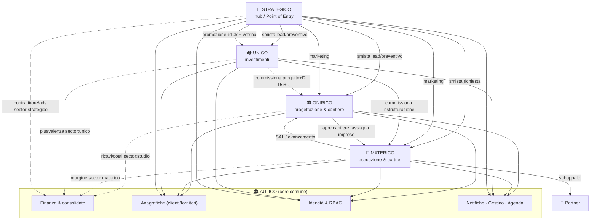

# Capitolato dei gestionali — responsabilità & interfacce

> **Scopo.** Definire, per ciascun gestionale, **cosa deve fare** (includendo ciò
> che è **già stato costruito**) e **come i gestionali si interfacciano tra loro**.
> È il ponte tra la visione (`VISIONE-AULICO.md`), i flussi (`FLUSSI-DI-LAVORO.md`)
> e l'architettura (`ARCHITETTURA-TARGET.md`).
>
> **Legenda stato:** ✅ già fatto (in codice oggi) · 🎯 target Aulico (da fare) ·
> ⚠️ parziale (esiste base, va esteso).
>
> Ricordo: **Aulico** = piattaforma + core comune; verticali = **Onirico** (=`studio`),
> **Materico**, **Unico**, **Strategico**. Chiavi codice/nodi DB invariati.
> ⚠️ **Nessuna modifica alla piattaforma**: documento di pianificazione.

---

## 0. I cinque gestionali a colpo d'occhio

| # | Gestionale | Missione in una riga | Possiede (dati) |
|---|---|---|---|
| 0 | **Aulico (core/Holding)** | infrastruttura comune neutra: identità, anagrafiche, finanza consolidata, servizi trasversali | `users`, `directory`, `clients`, `crmSuppliers`, nodi finanza, `quotes`, `notifications`, `appointments`, `teamLeave`, `trash` |
| 1 | **Onirico** (`studio`) | commesse di architettura: dal preventivo all'agibilità, con cantiere | `projects`, `tasks`, `documents`, `furnishings`, `moodboard3d`, `cantieri`+`cantiere*`, `impresa*`, `projectEconomics` |
| 2 | **Materico** | esecuzione lavori + subappaltatori (offerte, margine, contratti) | `matericoRequests` (+ indici) |
| 3 | **Unico** | investimenti immobiliari + investitori + ROE | `unicoDeals`, `unicoShowcase`, `unicoInvestorPositions` |
| 4 | **Strategico** | hub/Point of Entry + marketing + amministrazione di gruppo | `mktProjects` + `mkt*` |

---

## 1. Schema delle interfacce (mappa)

---

## 2. AULICO — core/Holding (gestionale n. 0)

**Missione.** Strato neutro e super partes su cui girano i 4 verticali. Non fa
business proprio: **offre servizi** che gli altri consumano.

**Già fatto ✅**
- Identità & ruoli, login email/Google, gestione accessi (`AuthFlow`,
  `AccessRequests`, `users`, `directory`).
- Anagrafiche condivise: rubrica clienti (`clients`), fornitori/partner
  (`crmSuppliers`), CRM (`CrmView`).
- Finanza consolidata: libri per società + consolidato (`FinanzeView`,
  `finance.ts`, nodi `finInvoices*/finScadenze/finBank`), preventivi (`quotes`),
  statistiche/BEP (`StatsView`).
- Servizi trasversali: notifiche (`notifications`), agenda/appuntamenti
  (`appointments`), ferie (`teamLeave`), **Cestino + doppia conferma** (`trash`,
  `askDelete`), Dashboard cross-società.

**Target Aulico 🎯**
- **RBAC granulare per-società** (`access: {societa → none|view|operate|admin}`),
  matrice ruoli + permesso esplicito "chi vede i lead" (privacy/GDPR). →
  `VISIONE-AULICO.md` §3/§11.
- **KPI funnel di gruppo**: Preventivato → Venduto → Erogato → Fatturato →
  Incassato → Liquidità, per società + consolidato (estende `StatsView`).
- **Servizi condivisi formalizzati** (oggi sparsi in `App.tsx`): vedi §8.

**Servizi che AULICO espone ai verticali (API interne — da formalizzare 🎯)**
| Servizio | Cosa fa | Oggi |
|---|---|---|
| `finance.record({sector, projectId, type, amount, …})` | registra costo/ricavo/scadenza nel consolidato | ⚠️ i verticali scrivono i nodi con `sector` |
| `contacts.get/select()` | leggere/selezionare clienti/fornitori | ✅ via props |
| `notify(uid \| studio, …)` | notifica persistente | ✅ `pushNotification`/`notifyStudio` |
| `trash.remove(section, payload)` + `askDelete` | eliminazione sicura + cestino | ✅ |
| `access.can(uid, societa, livello)` | check permessi | 🎯 (oggi `role/active`) |
| `publishSnapshot(target, data)` | pubblica snapshot read-only ai portali | ⚠️ pattern esistente, non astratto |

---

## 3. ONIRICO (`studio`) — gestionale n. 1

**Missione.** Gestire la commessa di architettura dal primo contatto al rilascio
dell'agibilità, includendo progettazione, arredi, cantiere e contabilità di
commessa.

**Già fatto ✅**
- Progetti/fascicolo, fasi & task (auto-assegnati per mansione), avanzamento 13
  step con viewer 3D (`ProjectsView`, `ThreeDProgress`).
- Documenti + chat (`DocumentsView`, `projectMessages`), generatore modulistica.
- Arredi & Moodboard 2D/3D (`FurnishingsBoard`, `projectMoodboard3d`).
- **Cantiere** completo (`CantiereBoard`: giornale, rapportini, presenze, foto
  GPS, SAL, documenti, registri, chat; Area Impresa).
- Contabilità di commessa + snapshot economico al cliente (`projectEconomics`).
- Indirizzo strutturato + catastali multipli.

**Target Aulico 🎯**
- **Funnel commessa**: voci di costo **predefinite** (listino) → preventivo rapido
  → **firma OTP** → **creazione automatica "Cartella Cliente" + task**.
- Fasi mappate su **Pianificazione · Progettazione · Esecuzione · Abilitazione**.
- **Naming commessa obbligatorio** `Nome Cliente + Località`.
- **Ogni attività** con responsabile + valore economico/**punteggio**.
- **Gamification cliente** alla chiusura (agibilità → "graduazione").
- Automazioni: **render AI** (foto lotto + questionario), **alert 60gg** scelte
  estetiche + blocco cantiere, **report settimanale automatico** al cliente.

**Interfacce**
- **Riceve** da Strategico: lead/preventivo smistati (🎯).
- **Riceve** da Unico: incarico **progetto + DL** (voce "Onirico 15%") (🎯 esplicito).
- **Apre cantiere** e **assegna imprese partner** (dominio Materico) ✅.
- **Espone** ad Aulico: parcelle/SAL/costi commessa → finanza `sector:studio` ✅;
  snapshot `projectEconomics` al portale cliente ✅.

---

## 4. MATERICO — gestionale n. 2

**Missione.** Eseguire i lavori facendo leva su una rete di subappaltatori:
raccogliere offerte, applicare il margine, gestire contratti e cantiere operativo.

**Già fatto ✅**
- Flusso completo: richiesta cliente → match partner (`crmSuppliers`) → inoltro →
  offerte (`offers`) ordinate per prezzo → margine 15% → invio al cliente con
  **bozza contratto** (`MatericoView`, `MatericoPortal`, `matericoRequests`).
- Indici inversi `clientMaterico`/`partnerMaterico`; portale partner.
- Esecuzione in cantiere (condivide `CantiereBoard`, lato partner).

**Target Aulico 🎯**
- **Firma OTP** del contratto + gestione scadenze contrattuali.
- **Penali automatiche** sui ritardi (monitoraggio scadenze → penale).
- **Point system** incentivi (punti per valore attività svolte).
- **Report cantiere** sicurezza/pulizia/organizzazione logistica via app.

**Interfacce**
- **Riceve** da Strategico: richieste smistate (🎯).
- **Riceve** da Onirico: assegnazione su un cantiere (impresa partner) ✅.
- **Riceve** da Unico: incarico **ristrutturazione** ✅ (da rendere commessa
  interna esplicita 🎯).
- **Subappalta** ai partner (offerte) ✅.
- **Espone** ad Aulico: margine → finanza `sector:materico` ✅; SAL → fattura ✅.

---

## 5. UNICO — gestionale n. 3

**Missione.** Gestire operazioni immobiliari (acquisto → ristrutturazione →
rivendita) con investitori, calcolando ROE e margini in modo trasparente.

**Già fatto ✅**
- Operazioni (`unicoDeals`): acquisto/ristrutturazione/rivendita, margine/ROI,
  **SPV/cap table** (quote, `unitPrice`, `investorUid`).
- **Rendiconto** (riparto profitto + distribuzioni) + **Aggiornamenti** investitori.
- **Doppio snapshot**: pubblico `unicoShowcase` (vetrina) + privato
  `unicoInvestorPositions` (portale investitore "I miei investimenti").
- Vetrina cinematica per-operazione (`UnicoShowcaseEditor`).

**Target Aulico 🎯**
- **Cascata ROE analitica**: Terreno + **Agenzia 3%** + Notaio + **Progettazione
  Onirico 15%** + Opere + **Promozione Strategico €10k** + **Rivendita 4%** →
  margine netto, tempi di ritorno, ROE (estende `finance.ts`).
- **Nota**: le società sono **quattro** (Onirico, Materico, Unico, Strategico) + holding
  Aulico. **Nessuna 5ª società** (l'idea "Gestione Immobili/affitti" del deck è scartata).

**Interfacce (Unico è il maggior "committente interno")**
- **Commissiona** a Onirico: progetto + DL → costo "Onirico 15%" / ricavo Onirico (🎯).
- **Commissiona** a Materico: ristrutturazione → costo opere (🎯 esplicito).
- **Commissiona** a Strategico: promozione/vendita → costo "Strategico €10k" /
  ricavo Strategico (🎯).
- **Espone** ad Aulico: plusvalenza → finanza `sector:unico` ✅; snapshot pubblico
  e privato ✅.
- **Verso investitori**: posizioni private + distribuzioni ✅.

---

## 6. STRATEGICO — gestionale n. 4

**Missione.** Doppio ruolo: (a) **hub/Point of Entry** del gruppo (tutti i lead
entrano da qui) e amministrazione di gruppo; (b) **verticale marketing** per le
altre società e per clienti esterni.

**Già fatto ✅**
- Marketing **project-centric** completo (`StrategicoView`, `mktProjects` + `mkt*`):
  Lead, Automation, SEO, Ads, Asset, Deliverable, Proofing, Eventi+RSVP, Campagne,
  Social, Sondaggi, Inbox, Analytics, Consensi, Contratti/Retainer (MRR), Time
  tracking, Report white-label + AI assist.
- Bridge economici → finanza `sector:strategico` ✅.

**Target Aulico 🎯**
- **Point of Entry esplicito**: tutti i lead/richieste preventivo entrano da
  Strategico e vengono **smistati** al verticale di competenza (crea progetto in
  Onirico / deal in Unico / richiesta in Materico).
- **Privacy/GDPR**: definire formalmente chi in Strategico vede tutti i nuovi
  clienti (permesso + log).
- **Amministrazione/contabilità di gruppo**: operata da Strategico ma sui servizi
  **neutri di Aulico** (vedi tensione risolta in `VISIONE-AULICO.md` §1).
- Produzione **foto/video** marketing.

**Interfacce**
- **Smista** lead/preventivi → Onirico/Unico/Materico (🎯).
- **Eroga marketing** a tutte le società (incl. **promozione Unico €10k**) (🎯 voce esplicita).
- **Espone** ad Aulico: contratti/ore/spese ads/eventi → finanza `sector:strategico` ✅;
  inviti/sondaggi al portale cliente ✅.

---

## 7. Catalogo delle interfacce inter-gestionali

Ogni riga = un "contratto" tra due gestionali. **Meccanismo** = come passa il dato
(da formalizzare con i pattern §8).

| # | Da → A | Cosa passa | Meccanismo | Stato |
|---|---|---|---|---|
| I1 | Strategico → Onirico/Unico/Materico | lead/preventivo smistato | crea entità nel verticale (commessa interna) | 🎯 |
| I2 | Unico → Onirico | incarico progetto + DL (15%) | commessa interna + costo Unico / ricavo Onirico | 🎯 |
| I3 | Unico → Materico | incarico ristrutturazione | commessa interna + costo opere | ⚠️→🎯 |
| I4 | Unico → Strategico | promozione/vendita (€10k) | commessa interna + costo Unico / ricavo Strategico | 🎯 |
| I5 | Onirico → Materico | apertura cantiere + assegnazione impresa | `cantieri.partnerUids` + indice `partnerCantieri` | ✅ |
| I6 | Materico → Onirico/Unico | SAL / avanzamento lavori | `cantiereSal` → fattura (`linkedInvoiceId`) | ✅ |
| I7 | Materico → Partner | subappalto / richiesta offerta | `matericoRequests` + `partnerMaterico` | ✅ |
| I8 | Tutti → Aulico/Finanza | costo/ricavo/scadenza | nodi finanza con `sector` (+`projectId`) | ✅ (da astrarre 🎯) |
| I9 | Verticali → Portali | dati divulgabili | **snapshot read-only** (`projectEconomics`, `unicoShowcase`, `unicoInvestorPositions`) | ✅ |
| I10 | Tutti → Aulico/Servizi | notifiche, cestino, agenda, anagrafiche, RBAC | servizi core | ✅ (RBAC 🎯) |
| I11 | Strategico → Cliente | inviti eventi / sondaggi | `mktInvitesIndex` + portale | ✅ |

> Le voci 🎯 I1-I4 sono il **vero lavoro di integrazione mancante**: oggi i flussi
> inter-società esistono "di fatto" ma non come **commesse interne esplicite e
> tracciabili a finanza**. Renderle esplicite è la chiave per il consolidato e per
> il ROE di Unico.

---

## 8. Pattern di integrazione standard (come si parlano)

Per non creare accoppiamenti disordinati, ogni interfaccia usa **uno** di questi
pattern (già in uso nel codebase, da generalizzare):

1. **Commessa interna** (🎯 nuovo) — un gestionale apre nell'altro un incarico con
   un riferimento condiviso; genera automaticamente le voci di costo/ricavo a
   finanza con il `sector` giusto. È il pattern per I1-I4.
2. **Convergenza a finanza** (✅) — qualunque evento economico scrive nei nodi
   finanza con `sector` (+`projectId`). Unico punto di verità per il consolidato.
3. **Snapshot read-only** (✅) — il verticale pubblica solo i dati divulgabili verso
   i portali (mai costi/dati sensibili). Pattern: `projectEconomics`,
   `unicoShowcase`, `unicoInvestorPositions`.
4. **Indici inversi** (✅) — per le viste di chi non possiede gli id (RTDB non
   filtra): `partnerMaterico`, `clientMaterico`, `partnerCantieri`, `mktInvitesIndex`.
5. **Servizi core** (✅/🎯) — notifiche, cestino, anagrafiche, RBAC: chiamati, non
   reimplementati.

**Regola d'oro:** un gestionale **non legge mai direttamente i dati interni di un
altro**. Comunica solo tramite uno di questi 5 pattern (commessa, finanza,
snapshot, indice, servizio core).

---

## 9. Matrice di dipendenze (chi dipende da chi)

| ↓ dipende da → | Aulico | Onirico | Materico | Unico | Strategico |
|---|---|---|---|---|---|
| **Onirico** | ✔ servizi/finanza | — | ✔ cantiere | (riceve incarico) | (riceve lead) |
| **Materico** | ✔ servizi/finanza | ✔ cantiere | — | (riceve incarico) | (riceve richiesta) |
| **Unico** | ✔ servizi/finanza | ✔ progetto/DL | ✔ ristruttura | — | ✔ promozione |
| **Strategico** | ✔ servizi/finanza | (smista) | (smista) | (eroga promo) | — |
| **Aulico** | — | — | — | — | (operato da Strategico) |

Lettura: **Unico è il più dipendente** (committente di tutti); **Aulico non
dipende da nessuno** (è il fondo); **Strategico** è speciale (verticale + hub).

---

## 10. Decisioni prese sulle interfacce ✅

Confermate dal committente — schema dati in **`SCHEMA-COMMESSE-INTERNE.md`**:
1. **Commesse interne (I1-I4)** = **entità dedicata** `internalOrders/<id>`.
2. **Voci ROE Unico** = **default override-abili per operazione** (3/15/€10k/4%).
3. **Bridge finanza** = **servizio core `finance.record()`** (+ coppia intercompany).
4. **Smistamento lead (I1)** = **automatico con conferma** (+ fallback manuale).

Restano solo punti minori non bloccanti (naming commesse, trigger di generazione,
momento di scrittura a finanza, payback) → `SCHEMA-COMMESSE-INTERNE.md` §6.

---

*Capitolato di riferimento. Aggiornare quando cambiano responsabilità o interfacce;
tenere in sync con `VISIONE-AULICO.md` e `ARCHITETTURA-TARGET.md`.*
