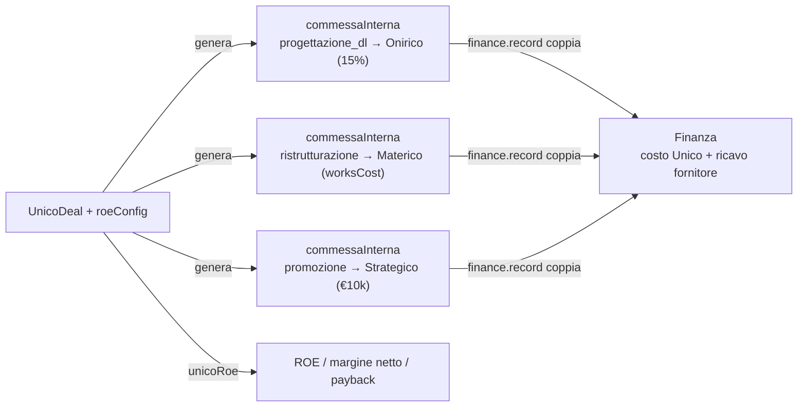
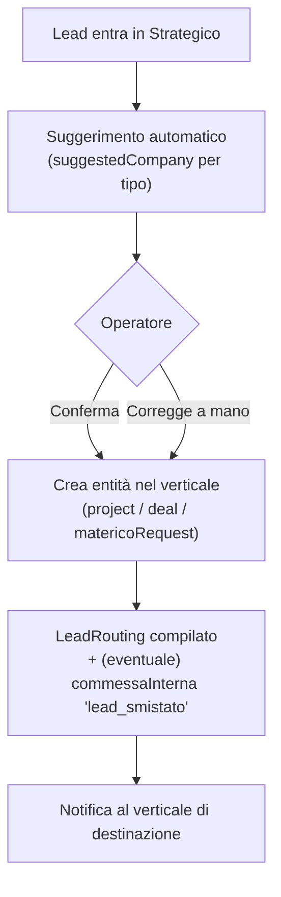

# Schema dati — commesse interne, finanza, ROE, smistamento lead

> **Scopo.** Tradurre in **schema dati concreto** le 4 decisioni prese sul wiring
> tra gestionali. È la base tecnica per implementare le interfacce I1–I4 di
> `GESTIONALI-SPECIFICHE.md`.
>
> **Decisioni recepite:**
> 1. Commesse interne = **entità dedicata** (`commessaInterna`).
> 2. Percentuali ROE Unico = **default override-abili per operazione**.
> 3. Bridge finanza = **servizio core `finance.record()`**.
> 4. Smistamento lead = **automatico con conferma** (+ fallback manuale).
>
> ⚠️ **Nessuna modifica alla piattaforma.** Schema proposto, da validare prima di
> scrivere codice. Le interfacce TS sono bozze (`?` = opzionale).

---

## 1. Entità `commessaInterna` (nodo `internalOrders/<id>`)

Il "contratto" tra due società del gruppo. Una commessa interna **genera sempre
una coppia di scritture in finanza**: un **costo** per il committente e un
**ricavo** per il fornitore (vedi §3, intercompany).

```ts
type Company = 'studio' | 'strategico' | 'materico' | 'unico';

type InternalOrderType =
  | 'progettazione_dl'   // Onirico → progetto + direzione lavori (Unico: 15%)
  | 'ristrutturazione'   // Materico → opere/lavori
  | 'promozione'         // Strategico → promozione/vendita (Unico: €10k)
  | 'marketing'          // Strategico → marketing generico
  | 'lead_smistato'      // Strategico → assegnazione lead a un verticale
  | 'altro';

type InternalOrderStatus =
  | 'bozza' | 'confermata' | 'in_corso' | 'completata' | 'annullata';

// Come si calcola l'importo della commessa
type InternalOrderBasis =
  | { mode: 'percent'; pct: number; ofAmount: number } // es. 15% del costo realizzazione
  | { mode: 'fixed'; amount: number }                  // es. €10.000
  | { mode: 'manual'; amount: number };                // importo digitato

interface InternalOrder {
  id: string;
  code: string;                  // numerazione leggibile progressiva: "CI-001", "CI-002"…
  type: InternalOrderType;
  title: string;                 // es. "Progettazione+DL – Nacci Grazio, C.da Lato Aperto"
  status: InternalOrderStatus;   // bozza → confermata (→ scrive finanza) → in_corso → completata

  // chi ORDINA (cliente interno) e chi ESEGUE (fornitore interno)
  committente: { company: Company; refType: 'project' | 'deal' | 'lead'; refId: string };
  fornitore:   { company: Company };

  basis: InternalOrderBasis;
  amount: number;                // risultato del calcolo (denormalizzato)
  description?: string;
  dueDate?: string;

  // collegamento alle scritture finanza generate (§3)
  financeRefs?: {
    costInvoiceId?: string;      // fattura passiva lato committente
    revenueInvoiceId?: string;   // fattura attiva lato fornitore
    scadenzaId?: string;
  };

  createdAt: string;
  createdBy: string;
}
```

**Note di modellazione**
- `committente.refId` lega la commessa all'operazione di origine (un `unicoDeals/<id>`,
  un `projects/<pid>`, un lead): così è tracciabile e si ricostruisce la cascata.
- `amount` è **denormalizzato** dal `basis` (ricalcolato quando cambia la base);
  tenere il `basis` permette di rigenerare e di mostrare "15% di €X".
- Lo **storico/stato** vive qui (è il vantaggio dell'entità dedicata vs solo-tag).

**Regole/permessi (target):** crea/conferma = chi ha `operate`/`admin` sulla società
**committente**; lettura = committente + fornitore + Aulico (consolidato). Nuovo
nodo → **aggiornare `firebase-rules.json`** + ripubblicare (come da workflow).

---

## 2. Cascata ROE di Unico (override-abile per operazione)

Estende `UnicoDeal` con la configurazione costi. **Default come costanti**, ma
ogni campo è **sovrascrivibile sul singolo deal**.

```ts
// finance.ts — nuovi default (override-abili)
const UNICO_AGENCY_PCT      = 3;      // % commissione agenzia su acquisto
const UNICO_ONIRICO_PCT     = 15;     // % progettazione Onirico su costo realizzazione
const UNICO_STRATEGICO_FEE  = 10000;  // € promozione Strategico (fisso)
const UNICO_RESALE_PCT      = 4;      // % commissione rivendita su prezzo finale

interface UnicoRoeConfig {
  // costi base (input dell'operazione)
  landCost: number;               // terreno/immobile
  notaryCost: number;             // oneri notarili
  worksCost: number;              // opere/lavori (idealmente = somma commesse Materico)
  resalePrice: number;            // prezzo di rivendita atteso/finale

  // percentuali/fissi — override per deal (se assenti → default sopra)
  agencyPct?: number;             // default 3
  oniricoPct?: number;            // default 15 (base = worksCost)
  strategicoFee?: number;         // default 10000
  resalePct?: number;             // default 4

  // date per il calcolo dei tempi di ritorno (payback)
  purchaseDate?: string;          // data acquisto immobile
  resaleDate?: string;            // data rivendita (stimata o effettiva)
}

// estensione del deal esistente
interface UnicoDeal {
  // …campi attuali (SPV, cap table, investors, ecc.)…
  roe?: UnicoRoeConfig;
  internalOrderIds?: string[];    // commesse interne generate (Onirico, Materico, Strategico)
}
```

**Funzione pura di calcolo (in `finance.ts`):**

```ts
interface RoeResult {
  agencyCost: number;     // landCost * agencyPct%
  oniricoCost: number;    // worksCost * oniricoPct%   → commessa interna a Onirico
  strategicoCost: number; // strategicoFee (fisso)     → commessa interna a Strategico
  resaleCost: number;     // resalePrice * resalePct%
  totalCost: number;      // land + agency + notary + onirico + works + strategico + resale
  netMargin: number;      // resalePrice − totalCost
  equity: number;         // capitale conferito investitori (da cap table)
  roe: number;            // netMargin / equity
  paybackMonths?: number; // tempi di ritorno (da purchaseDate → resaleDate)
}
function unicoRoe(cfg: UnicoRoeConfig, equity: number): RoeResult;
```

**Collegamento con le commesse interne (§1):** alla creazione/aggiornamento del
deal, le voci **Onirico 15%** e **Strategico €10k** (e la **ristrutturazione**
Materico) si materializzano come `InternalOrder` → che a loro volta scrivono in
finanza. La cascata ROE e il consolidato restano coerenti per costruzione.



---

## 3. Servizio core `finance.record()` (bridge unico verso la finanza)

Tutti i verticali smettono di scrivere direttamente i nodi finanza: chiamano
**un'unica API del core Aulico**. Confine netto, validazione in un solo posto.

```ts
type FinanceKind = 'active' | 'passive' | 'scadenza';

interface FinanceRecordInput {
  sector: Company;            // società a cui imputare il movimento
  kind: FinanceKind;
  amount: number;             // imponibile
  taxRate?: number;           // IVA (0/assente = non applicata)
  cassaPct?: number;
  description: string;
  date: string;
  dueDate?: string;

  // collegamenti (per consolidato, commessa, filtri)
  projectId?: string;
  dealId?: string;
  internalOrderId?: string;
  counterpartySector?: Company; // valorizzato per i movimenti intercompany
}

interface FinanceService {
  // scrive un singolo movimento → ritorna l'id creato
  record(input: FinanceRecordInput): Promise<string>;

  // scrive la COPPIA intercompany di una commessa interna:
  // costo (passiva) lato committente + ricavo (attiva) lato fornitore
  recordIntercompany(order: InternalOrder): Promise<{
    costInvoiceId: string;
    revenueInvoiceId: string;
  }>;
}
```

**Intercompany & consolidato (importante).** Le commesse interne creano ricavi e
costi *dentro il gruppo*. Nel **consolidato di gruppo** vanno **elisi** (non
gonfiano il fatturato di gruppo): i movimenti con `counterpartySector` valorizzato
sono marcati come **intercompany** e il motore `consolidato()` li nettizza. Per
società **singola** restano visibili (Onirico incassa davvero il suo 15%).

> Migrazione: gli handler attuali (`handleSaveFinanceItem`, `handleEmitMilestone`,
> `handleGenerate*Invoice`, bridge Strategico) diventano **wrapper** sopra
> `finance.record()` → nessun cambio funzionale, solo centralizzazione.

---

## 4. Smistamento lead — automatico con conferma (+ manuale)

Strategico è il **Point of Entry**. Il lead entra, il sistema **propone** il
verticale, l'operatore **conferma** (un click) o **corregge** manualmente.

```ts
interface LeadRouting {
  suggestedCompany?: Company;   // proposta automatica (per tipo richiesta)
  routedCompany?: Company;      // scelta confermata
  routedRefType?: 'project' | 'deal' | 'matericoRequest';
  routedRefId?: string;         // entità creata nel verticale
  routedBy?: string;
  routedAt?: string;
}
// si aggancia all'entità lead esistente (crmLeads / mktLeads)
```

Regola di suggerimento (esempi, configurabile):
- richiesta di **costruzione/ristrutturazione casa** → Onirico
- richiesta di **fornitura/posa** → Materico
- **opportunità di investimento** → Unico
- richiesta **marketing** → Strategico



**Fallback manuale:** se non c'è suggerimento (tipo non riconosciuto), l'operatore
smista a mano; il sistema non instrada mai **da solo senza conferma**.

---

## 5. Nuovi nodi DB & impatto regole (riepilogo)

| Nodo | Contenuto | Scope (target) |
|---|---|---|
| `internalOrders/<id>` | commesse interne (§1) | committente + fornitore + Aulico |
| (estende) `unicoDeals/<id>.roe` | config cascata ROE (§2) | come `unicoDeals` |
| (estende) `crmLeads`/`mktLeads[].routing` | smistamento lead (§4) | come oggi |

I movimenti finanza **non** introducono nodi nuovi: riusano `finInvoicesActive/
Passive`, `finScadenze` (+ flag `counterpartySector`/intercompany). **Aggiornare le
regole** per `internalOrders` e ripubblicarle (workflow standard).

---

## 6. Decisioni di dettaglio prese ✅

1. **Numerazione**: prefisso **`CI-` progressivo** (`CI-001`, `CI-002`…), campo
   `code` su `InternalOrder`.
2. **Generazione**: **automatica al salvataggio del deal** Unico → crea/aggiorna
   le 3 commesse (Onirico 15%, Materico opere, Strategico €10k) sempre in sync con
   la cascata ROE.
3. **Scrittura finanza**: **alla conferma** della commessa (stato `confermata`) si
   registra l'impegno (coppia costo+ricavo); importi rettificabili fino a
   `completata`.
4. **Payback ROE**: **sì** — aggiunte `purchaseDate`/`resaleDate` al `roeConfig` e
   `paybackMonths` al risultato.

---

*Schema di riferimento. Da validare sui 4 punti §6, poi diventa la specifica
implementativa delle interfacce I1–I4.*
